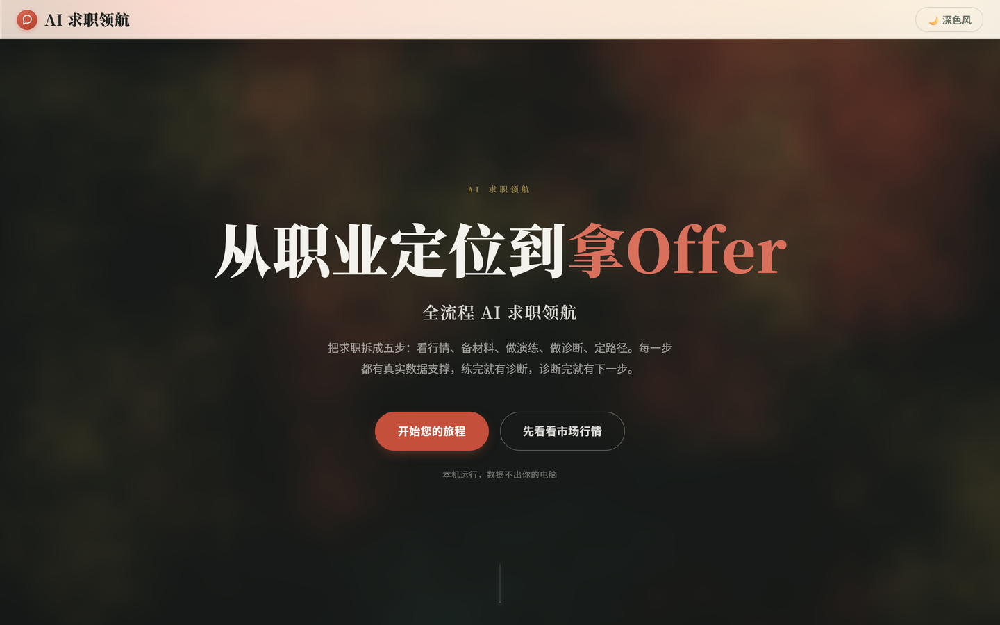
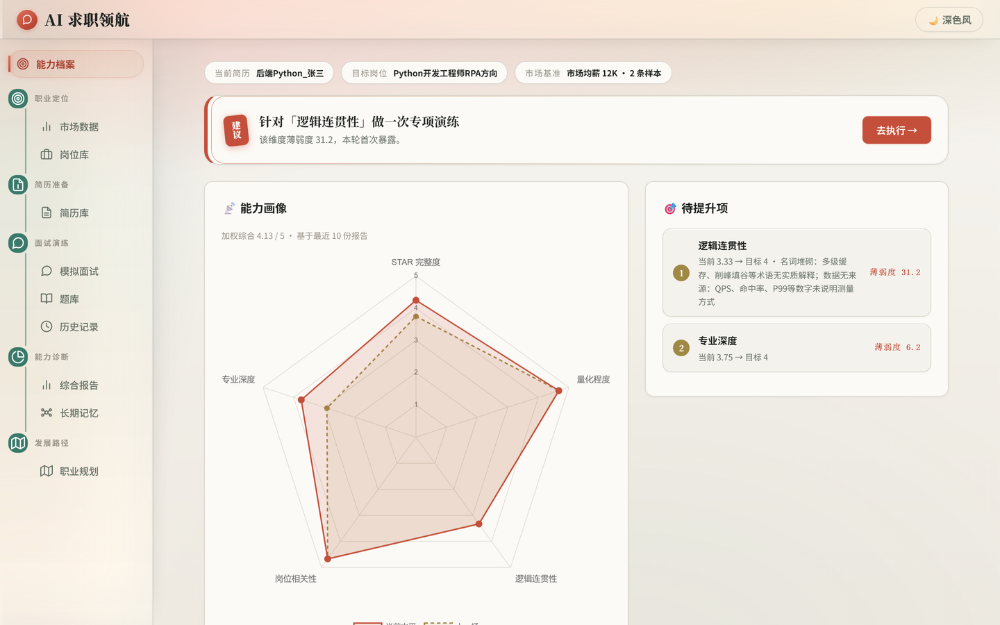
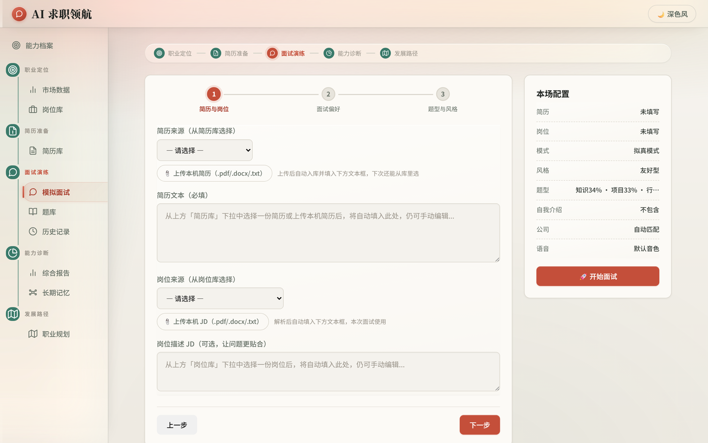

<h1 align="center">🤖 AI 求职领航</h1>

<p align="center">
  <strong>从职业定位到拿 Offer 的全流程 AI 陪跑系统</strong><br>
  市场洞察 · 简历岗位资产 · AI 多轮面试演练 · 五维诊断报告 · 长期记忆 · 职业规划
</p>

<p align="center">
  
  
  
  
  <a href="https://github.com/cloudy-one1/AI-Career-Navigator/actions/workflows/ci.yml"></a>
  
</p>

<p align="center">
  单用户本地工具：数据全存本机、全站免登录、一个视图。<strong>改一行配置即可换 LLM 后端。</strong>
</p>

---

## 项目简介

求职者的问题不是"找不到面试题"，而是**练完不知道自己弱在哪、下一步该做什么**。
AI 求职领航把求职拆成五步主线，每一步都有数据支撑与产出物，且**练完必诊、诊完即有下一步**：

**职业定位**（市场数据 + 岗位库）→ **简历准备**（简历库）→ **面试演练**（AI 多轮模拟面试）
→ **能力诊断**（五维报告 + 长期记忆）→ **发展路径**（时间轴职业规划）

首屏是**能力档案**：以「求职档案」为领域核心，把三个能力模块从并列功能降级为档案的读写者，
形成「目标 → 现状 → 差距 → 行动 → 复测」的陪跑闭环。

## 界面预览

<p align="center">
  
  <br><sub>产品落地页（three.js WebGL 墨晕 Hero，独立入口）</sub>
</p>

<p align="center">
  
  <br><sub>能力档案首屏：五维画像、下一步建议（纯规则表产出，不调 LLM）、待提升项</sub>
</p>

<p align="center">
  
  <br><sub>模拟面试：三步准备向导 + 右侧本场配置（模式 / 风格 / 题型配比 / 公司 / 语音）</sub>
</p>

## 核心特性

**诊断内核**

- **五维诊断**：STAR 完整性 / 量化程度 / 逻辑连贯性 / 岗位相关性 / 专业深度，权重按 JD 动态调整；每个维度附**候选人原话引用**，把主观打分锚定到可复核证据
- **双 Agent 协作**：Diagnostician（诊断评分）与 Rewriter（改写示范）独立分步，避免同一模型为产出漂亮改写而调高自评分
- **拟真面试流程**：6 阶段拟真模式（破冰 → 技术广度 → 技术深度 → 项目拷问 → 行为面 → 反问）与 5 轮次传统模式，7 种面试官风格 + 公司风格 YAML 配置层，会话中可随时切换
- **只用简历证据**：本地关键词 + 优先级加权检索实时产出证据包，硬约束模型只依据简历证据或亲述评价，杜绝编造经历；检测到"不会答"自动切辅导式引导

**资产与闭环**

- **简历库 / 岗位库**：跨会话复用的输入资产，一次上传解析、反复选用
- **长期记忆**：薄弱点跨场累计，做 EMA 衰减与过期淘汰，回注入后续面试；2D 记忆图谱可视化
- **市场数据**：内嵌 Playwright 实时采集 + 存量数据导入，含岗位检索、统计图表与 AI 解读
- **Gap 分析与职业规划**：简历-岗位六维透明匹配、一份简历对多岗位的择岗建议，并以 Gap 快照为基线推理多阶段时间轴路径
- **语音交互**：小米 MiMo 云端 TTS/ASR 优先，未配 Key 或失败自动降级浏览器原生语音

**工程保障**

- **多 AI 后端与优雅降级**：DeepSeek / 通义千问 / 智谱 GLM / OpenAI 可切换，`AI_PROVIDER=auto` 自动探测；主模型失败按回落链自动切备用模型
- import-linter 强制 L1–L4 分层契约、1000+ pytest 用例（含黄金样本评测与 live-LLM 抽检）、前端 vitest、GitHub Actions CI、dependabot 每周维护依赖

## 快速开始

### 环境要求

- Python 3.12+；至少一个 LLM API Key（推荐 [DeepSeek](https://platform.deepseek.com/)）
- Node 20+（仅前端开发模式需要）

### 源码运行

```bash
git clone https://github.com/cloudy-one1/AI-Career-Navigator.git
cd AI-Career-Navigator

python -m venv .venv
source .venv/bin/activate        # Windows: .venv\Scripts\activate
pip install -r requirements.txt

python -m playwright install chromium   # 可选：市场数据实时采集需要
cp .env.example .env                    # 填入至少一个 AI 后端的 Key

python run.py                    # → http://localhost:8000（API 文档 /docs）
```

前端开发模式（热更新）：

```bash
cd frontend && npm install
npm run dev                      # http://localhost:5173，自动代理 /api /ws /upload 到 :8000
npm run build                    # 产出 dist/，由 FastAPI 托管
```

> ⚠️ **改完前端必须执行 `npm run build`**：`run.py` 托管的是 `frontend/dist`（不入库），
> 只改 `src/` 不构建的话界面不会变化。

### Docker

```bash
cp .env.example .env      # 填入 API Key
docker compose up -d      # 日志：docker compose logs -f；停止：docker compose down
```

`./data/` 挂载到容器，面试记录、题库、上传文件存宿主机，容器销毁不丢数据。

### 配置

全部可选项集中在 [`.env.example`](.env.example)（含逐项注释），最小配置只有两行：

```bash
AI_PROVIDER=deepseek      # deepseek / qwen / zhipu / openai / auto
DEEPSEEK_API_KEY=sk-xxx
```

其余能力按需开关：`LLM_FALLBACK_CHAIN`（多模型优雅降级）、`LLM_TASK_MODELS`（任务级模型绑定）、
`MIMO_API_KEY`（云端语音，不配则用浏览器原生语音）、`MARKET_CRAWL_*`（采集节奏与口令）。

## 使用流程

1. **看能力档案**：一眼看到「当前简历 / 目标岗位 / 能力水平 / 待提升项」与**下一步建议**；
   完成第二场面试后成长曲线开始显示轨迹。
2. **建立素材库**：「简历库」上传一次简历（完整入库不截断），「岗位库」保存常练的 JD。
3. **开练**：面试面板选简历与岗位 → 开始面试，支持文字或语音作答，会话中可切模式与阶段。
4. **复盘**：报告页每维度评分附**候选人原话引用**，可逐条核对"这个分凭什么"；
   支持 Markdown / HTML 导出自用。

## 项目结构

```
├── run.py                # 一键启动入口 + lint 子命令（import-linter）
├── backend/              # FastAPI 后端：L1 基础设施 → L2 领域数据 → L3 业务逻辑 → L4 路由
│   ├── routers/          #   HTTP/WS 路由按域拆分
│   ├── market/           #   市场数据（清洗/导入/聚合/解读 + 内嵌 Playwright 采集器）
│   └── interview_engine/ #   面试状态机 + 流程决策 + 报告生成
├── frontend/             # 原生 ES Module 前端（Vite 工程化，双入口：SPA + 落地页）
├── tests/                # 后端 pytest（1000+ 用例，含黄金样本评测与仓库卫生断言）
├── docs/                 # 公开文档：架构地图 / 测试 / API / 已知局限 / 历史变更
└── data/                 # 运行时数据（自动创建，不入库）
```

逐模块的代码地图见 [docs/architecture.md](docs/architecture.md)。

## 文档

| 文档 | 内容 |
|---|---|
| [docs/architecture.md](docs/architecture.md) | 技术栈、L1–L4 分层契约、全量代码地图、诊断体系与面试模式 |
| [docs/testing.md](docs/testing.md) | 测试五层分工、常用命令、CI 与 dependabot 口径 |
| [docs/API.md](docs/API.md) | 59 个 HTTP 端点 + 1 个 WebSocket 的逐条清单与限流档位 |
| [docs/LIMITATIONS.md](docs/LIMITATIONS.md) | 已知局限与架构取舍（含可选演进方向） |
| [CHARTER.md](CHARTER.md) | 项目宪章：产品命题、架构约束、决策记录卡 DC-01 ~ DC-10 |
| [CHANGELOG.md](CHANGELOG.md) | 版本迭代叙事（v8.0 起；更早见 [docs/changelog-archive.md](docs/changelog-archive.md)） |

## 开发与贡献

环境搭建、提交前必做的四道检查、Commit 规范与文档同步要求见
[.github/CONTRIBUTING.md](.github/CONTRIBUTING.md)。本地跑起来只需三条：

```bash
python run.py lint        # 分层依赖契约
pytest tests/ -q          # 后端全量测试
cd frontend && npm run test && npm run build
```

提交 Issue 前请先读 [docs/LIMITATIONS.md](docs/LIMITATIONS.md) 与
[.github/SECURITY.md](.github/SECURITY.md)——欢迎 Star ⭐ 与真实使用反馈。

## 已知局限（诚实披露）

以下不是待修的 bug，而是**单用户本地工具**定位下的刻意取舍，全文 27 条见
[docs/LIMITATIONS.md](docs/LIMITATIONS.md)：

- **无认证 / 无身份校验**：v7.0 曾引入，v8.3 经决策卡 DC-10 整体下线；数据全存本机
- **内容护栏是启发式，不是安全边界**：正则防不住认真的攻击者，已知绕过方式见
  [.github/SECURITY.md](.github/SECURITY.md)
- **诊断质量依赖 LLM**：1000+ 用例验证的是**工程正确性**，诊断有效性靠黄金样本回归 +
  live-LLM 抽检做可观测，模型质量仍需人工评审
- **SQLite 单文件库 + 全局单例**：多 Worker 下 WebSocket 需 sticky session
- **无断点续答**：流程位置已落库，但进程重启后不从 DB 重建会话

## 许可证

[MIT License](LICENSE)。
