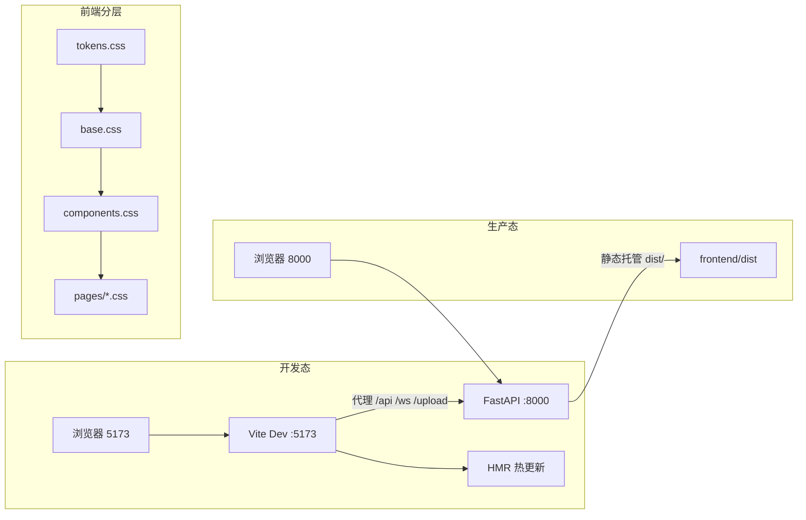

# 前端设计方案 — AI 模拟面试官与职业规划（UI/UX 重构）

> | 项 | 值 |
> |---|---|
> | 文档版本 | v0.1（评审稿） |
> | 日期 | 2026-08-27 |
> | 适用基线 | 项目 v3.2（见 CHANGELOG.md） |
> | 目标版本 | v4.0 UI（实施阶段另行编号） |
> | 状态 | 待评审 |
> | 后端契约 | 本轮**零变更**（仅静态托管路径在迁移阶段小幅调整） |

---

## 1. 设计理念与风格基调

### 1.1 产品语境

本产品是"AI 模拟面试官与职业规划"：用户上传简历 + 目标岗位 → AI 生成面试题并逐题作答 → 五维诊断（STAR 完整性 / 量化程度 / 逻辑连贯性 / 岗位相关性 / 专业深度）实时反馈 → 生成综合报告与职业发展路径。

用户使用产品的核心动机不是"浏览界面"，而是**在高压场景下获得可信、可操作、不令人焦虑的反馈**。因此界面的首要职责是：降低认知负担、建立专业信任、让 AI 的思考过程"可见"，从而让用户专注于"答好每一题"。

### 1.2 用户画像与场景

| 场景 | 情绪状态 | 界面诉求 |
|---|---|---|
| 投简历前突击面试 | 紧张、时间紧 | 3 分钟内能开练，配置项最少化、过程可视化 |
| 面试中逐题作答 | 专注、被观察感 | 沉浸、无干扰、反馈即时 |
| 答题后看诊断 | 忐忑、怕被否定 | 先给结果再给细节，弱项呈现要"建设性"而非"审判式" |
| 复盘多场面试 | 反思、求方法 | 对比、趋势、可执行建议 |
| 做职业规划 | 迷茫、求方向 | 可视化路径、里程碑、时间轴 |

### 1.3 双基调：专业可信 + 教练陪伴

- **专业可信（主基调）**：延续 Indigo 品牌色 `#4F46E5`，传达"诊断权威"。布局大留白、卡片层级分明、数字排版等宽，塑造可靠、克制、有体系感的工具气质。
- **教练陪伴（副基调）**：引入暖琥珀色 `#F59E0B` 作为"鼓励/成长/里程碑"专属点缀色，配合友好微文案（如空态"准备好就开练吧"），缓解求职焦虑。
- **克制 AI 反馈（技术层）**：流式打字、阶段徽章、雷达呼吸光晕只用于**状态表达**（思考中/诊断中/朗读中），不做装饰性动画，避免喧宾夺主。

> 决策依据：见附录 A 决策记录卡 AD-01。

### 1.4 四项设计原则

1. **旅程优先（Journey-first）**：导航与页面按"准备 → 实战 → 复盘 → 规划"组织，而非功能罗列；用户永远知道"自己在旅程的哪一步、下一步是什么"。
2. **层次即节奏（Hierarchy = Rhythm）**：单屏内信息按"结果 > 操作 > 解释 > 元信息"排序；用三级卡片（白卡 / 浅底卡 / 描边卡）建立空间层次，用字号/字重建立文本层次。
3. **过程可见（Process over Magic）**：AI 的一切耗时行为（流式生成、诊断计算、报告生成）都必须有阶段态、进度与可中断入口，让用户"看见思考"而不是等待黑盒。
4. **状态先行（State-first）**：每个页面/模块在实现前先定义空态、加载态、成功态、错误态四态，杜绝"白屏"与"无声失败"。

### 1.5 关键设计决策记录

| 编号 | 决策 | 选择 | 备选与取舍 |
|---|---|---|---|
| AD-01 | 视觉基调 | 专业 Indigo + 温暖琥珀 + 克制科技感 | 深色科技风（降低长时阅读舒适度）；纯暖色（削弱诊断权威感） |
| AD-02 | 导航形态 | 桌面左垂直导航 → 平板图标栏 → 移动底部 Tab | 保持顶部 Tab（信息容纳差、无法承载状态灯） |
| AD-03 | 面试工作台 | 单面板三态（准备/实战/复盘）步骤条串联 | 三张独立页面（割裂上下文，往返成本高） |
| AD-04 | 工程化 | 引入 Vite，保持原生 ES Module + 原生 CSS | 引入 React/Vue（超出宪章范围纪律）；维持纯 CDN（无法模块化 CSS、无热更新） |
| AD-05 | 实时雷达 | 实战页右侧常驻面板，刷新时动画过渡 | 仅复盘展示（浪费"实时"能力）；底部悬浮（遮挡内容） |
| AD-06 | 深色模式 | 本期不做，Token 预留 `data-theme` 扩展位 | 本期做（范围膨胀，延迟核心交付） |

---

## 2. 现状分析与问题诊断

### 2.1 架构现状（勘察摘要）

- **托管方式**：`backend/main.py:1100` `app.mount("/", StaticFiles(directory="frontend", html=True))`，前后端同源同端口，无 SPA fallback。
- **运行方式**：`run.py` 启动 uvicorn（`:8000`），`--dev` 仅热重载 `backend/`；另有 `lint` 子命令。
- **前端形态**：`frontend/index.html`（51 行）+ 单文件 `css/style.css`（1061 行）+ 10 个 ES Module 文件（`app/api/utils/interview/report/history/questionBank/careerPlan/liveRadar/voice`）。
- **组件方式**：全部 UI 由 `utils.js` 的 `el()` DOM 工厂函数动态生成；`$`/`$$` 选择器、`toast()` 通知已具备。
- **依赖**：Chart.js v4.4.0 走 jsDelivr CDN 全局引入；无 npm / 无构建工具 / 无 package.json。
- **导航**：`app.js` 顶部 5 个 Tab 按钮 + `switchTab()` 懒加载切换；面板渲染由各模块 `init*()` 负责。
- **Token**：`:root` 已有 21 个 CSS 变量（primary/bg/card/text/radius/shadow/transition 等），随版本 v2.3–v3.2 注释分区累积。

### 2.2 主要问题清单

| # | 类别 | 问题 | 影响 |
|---|---|---|---|
| P1 | 信息架构 | 5 个 Tab 平铺，无旅程感；"职业规划"与"报告/面试"关联弱 | 用户不知道先做什么、下一步是什么 |
| P2 | 布局 | 内容区固定 960px 单栏，实战页对话与诊断纵向堆叠 | 实时雷达与权重需要滚动才可见，反馈滞后 |
| P3 | 视觉 | emoji 图标 + 单一卡片层级，版本累积导致样式不一致（1061 行单文件） | 观感廉价、层次扁平、维护成本高 |
| P4 | 状态 | 多数模块仅有 loading，空态/错误态覆盖不全 | 空白页与静默失败伤害信任 |
| P5 | 交互 | 准备表单一屏堆叠（简历/岗位/模式/风格/题型），无分步与即时校验 | 配置成本高，首次开练门槛高 |
| P6 | 动效 | 仅 hover/transition 基本反馈，无进场、无流式节奏 | 缺乏"生命感"，AI 过程不可感知 |
| P7 | 工程 | 单文件 CSS、CDN 依赖、无热更新 | 迭代慢、无法拆层、离线不可用 |
| P8 | 响应式 | 仅 640px 一处断点 | 平板/移动端体验差 |

> 上述问题已按优先级映射到第 10 章实施阶段的验收标准。

---

## 3. 信息架构与导航

### 3.1 用户旅程五步

```
 ① 准备 Setup ──> ② 实战 Session ──> ③ 复盘 Diagnosis ──> ④ 报告 Report
       简历 + 岗位       逐题作答 + 实时诊断    五维结果 + 改写示范     跨轮次综合洞察
       模式 + 偏好       追问 + 语音            风险点 + 改进建议       对比 + 趋势
                                                                        │
                                             ⑤ 规划 Career ───────────┘
                                            基线快照 + 时间轴 + 技能曲线
```

- **① 准备**：配置面试（简历、岗位、模式、风格、题型）。目标：3 分钟完成。
- **② 实战**：沉浸式逐题作答，右侧常驻诊断面板实时刷新。
- **③ 复盘**：单题诊断结果（总分 + 五维 + 改写示范 + 风险点）。
- **④ 报告**：跨轮次综合分析（Dashboard）。
- **⑤ 规划**：Gap 基线 + 分阶段职业路径（长期目标，与面试循环解耦但数据同源）。

### 3.2 导航重构

**目标形态**：`Header（全局状态） + 左垂直导航（旅程顺序） + 内容区`

| 项 | 桌面 ≥1024px | 平板 768–1024px | 移动 <768px |
|---|---|---|---|
| 导航形态 | 左侧 220px 固定导航（图标 + 文字 + active 指示条） | 收起为 64px 图标栏 | 底部 Tab 栏（5 项，图标 + 文字） |
| 面试状态灯 | Header 右侧常驻 | 同左 | 折叠进实战页顶部 |
| 内容区 | 1120px 居中 | 全宽 | 全宽 + 安全区 |

**导航项顺序**（旅程优先排序，替换现有 `💬面试/📊报告/📜历史/📚题库/🧭职业规划`）：

| 顺序 | 模块 | 图标（SVG） | 文案 | 定位说明 |
|---|---|---|---|---|
| 1 | 面试 | 对话气泡 | 模拟面试 | 核心工作台，默认落地页 |
| 2 | 报告 | 仪表盘 | 综合报告 | 复盘成果，旅程第二步 |
| 3 | 历史 | 档案 | 历史记录 | 成长档案与回看 |
| 4 | 题库 | 书 | 题库 | 弹药库（辅助，非主线） |
| 5 | 规划 | 路径 | 职业规划 | 长期目标 |

> 图标统一替换 emoji 为内联 SVG（`src/js/ui/icons.js` 集中管理），保证跨平台渲染一致。

### 3.3 页面地图与关系

```
index.html（单页应用）
├── #app-header        Header：Logo + 版本徽章 + 面试状态灯
├── #app-nav           左垂直导航（5 项，见 3.2）
└── #main              内容区
    ├── interview-panel  三态：setup / session / diagnosis（步骤条串联）
    ├── report-panel      Dashboard：总分卡/雷达/轮次时间线/强弱项
    ├── history-panel     会话列表 + 详情抽屉
    ├── question-bank-panel  题库 CRUD + 收藏 + 导入
    └── career-panel      基线卡 + 时间轴路径 + 技能曲线
```

---

## 4. 视觉系统（Design Tokens）

> 实施形态：`frontend/src/css/tokens.css`，以 CSS 变量承载全部设计决策，禁止在组件中硬编码颜色/间距。

### 4.1 色彩体系

**品牌主色（Indigo 阶梯）**——专业与可信：

| Token | 值 | 用途 |
|---|---|---|
| `--indigo-50` | `#EEF2FF` | 选中态浅底、hover 底 |
| `--indigo-100` | `#E0E7FF` | 标签浅底 |
| `--indigo-500` | `#6366F1` | 次级强调 |
| `--indigo-600` | `#4F46E5` | **主色**（按钮、链接、active） |
| `--indigo-700` | `#4338CA` | 主色 hover / pressed |
| `--indigo-800` | `#3730A3` | 深底场景 |

**辅助色（教练陪伴）**——暖琥珀仅用于鼓励/里程碑/成长：

| Token | 值 | 用途 |
|---|---|---|
| `--amber-500` | `#F59E0B` | 里程碑、成长标记、提示条 |
| `--amber-50` | `#FFFBEB` | 琥珀浅底 |

**功能色**：

| Token | 值 | 用途 |
|---|---|---|
| `--green-500` | `#10B981` | 成功、高分（≥80） |
| `--red-500` | `#EF4444` | 危险、低分（<60） |
| `--blue-500` | `#3B82F6` | 信息、链接、中性强调 |
| `--orange-500` | `#F97316` | 中低分（60–69）警示 |

**中性色（Slate 阶梯）**：

| Token | 值 | 用途 |
|---|---|---|
| `--slate-900` | `#0F172A` | 主文本 |
| `--slate-700` | `#334155` | 次文本 |
| `--slate-500` | `#64748B` | 辅助文本 |
| `--slate-400` | `#94A3B8` | 弱化文本/占位 |
| `--slate-200` | `#E2E8F0` | 描边、分隔线 |
| `--slate-100` | `#F1F5F9` | 浅底卡、分区底 |
| `--slate-50` | `#F8FAFC` | 页面背景 |

> 与现有 `:root` 变量映射见附录 B（`--primary → --indigo-600` 等，迁移期做别名兼容）。

### 4.2 字体与排版

- **字体栈**：`"PingFang SC", "Microsoft YaHei", -apple-system, "Segoe UI", Roboto, sans-serif`。
- **数字排版**：所有分数/数值容器启用 `font-variant-numeric: tabular-nums`，保证滚动时数字不错位。
- **字号阶梯**（`--font-*`）：

| Token | 值 | 用途 |
|---|---|---|
| `--text-xs` | 12px | 元信息、徽章 |
| `--text-sm` | 13px | 辅助说明 |
| `--text-base` | 14px | 正文（默认） |
| `--text-md` | 16px | 卡片标题、子标题 |
| `--text-lg` | 18px | 面板标题 |
| `--text-xl` | 22px | 页面大标题（权重 700） |
| `--text-2xl` | 28px | 总分大数字 |
| `--text-3xl` | 36px | 复盘页总分 Hero（权重 800） |

行高：正文 1.6，标题 1.3。字重：400 / 600 / 700 / 800 四级。

### 4.3 间距网格

4pt 基准：`4 / 8 / 12 / 16 / 24 / 32 / 48 / 64`。Token：`--space-1..--space-8`。
- 卡片内边距：16px（`--space-4`）；模块间距：24px；页面 section 间距：32px。

### 4.4 圆角

| Token | 值 | 用途 |
|---|---|---|
| `--radius-sm` | 8px | 输入框、徽章、小按钮 |
| `--radius-md` | 12px | 卡片、按钮（现有基准） |
| `--radius-lg` | 16px | 大卡、面板、弹层 |
| `--radius-full` | 999px | 头像、状态灯、pill 标签 |

### 4.5 阴影

| Token | 值 | 用途 |
|---|---|---|
| `--shadow-sm` | `0 1px 2px rgba(15,23,42,.05)` | 描边卡、悬浮浅层 |
| `--shadow-md` | `0 4px 12px -2px rgba(15,23,42,.08)` | 白卡默认（一层 8% 阴影） |
| `--shadow-lg` | `0 12px 32px -8px rgba(15,23,42,.14)` | 弹层、抽屉、hover 提升 |
| `--shadow-glow` | `0 0 0 4px rgba(79,70,229,.12)` | 焦点环 / active 光晕 |

### 4.6 动效时长

| Token | 值 | 用途 |
|---|---|---|
| `--dur-fast` | 150ms | 按钮按压、hover 变色 |
| `--dur-base` | 250ms | 卡片过渡、面板切换 |
| `--dur-slow` | 350ms | 抽屉、遮罩、大块面 |
| `--ease-out` | `cubic-bezier(.16,1,.3,1)` | 标准退出（全局默认） |
| `--ease-spring` | `cubic-bezier(.34,1.56,.64,1)` | 评分跳动、徽章弹出 |

> 位移动画幅度 ≤ 8px；全部动画尊重 `prefers-reduced-motion`（见 8.5）。

### 4.7 三级卡片层次

| 层级 | 样式 | 用途 |
|---|---|---|
| L1 白卡 | 白底 + `--shadow-md` + `--radius-lg` | 主内容（题目卡、结果卡、摘要卡） |
| L2 浅底卡 | `--slate-50`/`--indigo-50` 底 + 无阴影 + `--radius-md` | 次级内容、分组信息 |
| L3 描边卡 | 白底 + 1px `--slate-200` 描边 + `--shadow-sm` | 弱关联、列表项、可折叠区 |

---

## 5. 组件体系

> 实施形态：`src/js/ui/` 目录按组件拆分，基于现有 `el()` 工厂模式演进为 `createXxx()` 组件工厂；样式落在 `src/css/components.css` 对应分区。

### 5.1 基础组件

| 组件 | 说明 | 状态/变体 |
|---|---|---|
| `Button` | 主/次/幽灵/危险四变体；可含 loading 态（内置 spinner） | default/hover/pressed/disabled/loading |
| `Input` / `Textarea` | 含 label、hint、error 三区；即时校验态 | default/focus/error/success |
| `Select` / `Radio` / `Checkbox` | 原生控件 + 统一视觉 | 同上 |
| `Tag` / `Badge` | pill 标签；等级色（green/amber/red/indigo/neutral） | 默认/可关闭 |
| `Tooltip` | hover/焦点触发，`--shadow-lg`，延迟 300ms | — |
| `Toast` | 升级现有 toast：类型图标 + 可操作（如"重试"） | info/success/warning/error |
| `Skeleton` | 骨架屏，呼吸式 shimmer | — |
| `Modal` / `Drawer` | 居中弹层 / 右侧抽屉（移动端诊断面板复用） | 遮罩点击关闭、Esc 关闭 |
| `Switch` | 布尔开关（如自我介绍环节开关） | — |

### 5.2 数据展示组件

| 组件 | 说明 |
|---|---|
| `ScoreRing` | 环形总分（SVG 描边动画，复盘页 Hero） |
| `RadarCard` | 五维雷达（Chart.js 封装为 `renderRadar(el, data, opts)`） |
| `DimBar` | 单维横向条：名称 + 得分 + 渐变进度 + 最弱维度高亮 |
| `ScoreDelta` | 得分对比（较上轮 ±N，上绿下红） |
| `ProgressSteps` | 步骤条（准备阶段 3 步 / 实战阶段 4 步） |
| `Timeline` | 纵向时间轴（职业路径）与横向时间轴（报告轮次） |
| `MetricGrid` | 指标网格（数据卡：标题/大数字/说明） |
| `Table` | 题库表格：斑马纹 + hover + 行操作 |

### 5.3 领域组件（面试场景专属）

| 组件 | 说明 |
|---|---|
| `InterviewerCard` | 面试官头像 + 风格徽章（严格/友好/压力），切换动画 |
| `QuestionCard` | 题目卡：序号 + 题型标签 + 题干 + 难度 |
| `AnswerBox` | 回答输入区：多行输入 + 语音按钮 + 字数/时间提示 |
| `StreamBox` | 流式输出容器：打字机逐字渲染 + 阶段徽章 + 终止按钮 |
| `DiagnosisCard` | 单题诊断结果：ScoreRing + DimBar 组 + 风险点 + 改写示范（原文/示范对照） |
| `BaselineCard` | 职业规划基线快照：六维迷你条 + 匹配风险徽章 |
| `SkillCurve` | 技能累计曲线（Chart.js 折线） |
| `SessionCard` | 历史会话卡：岗位 + 模式 + 得分 + 时间 |

### 5.4 状态组件（四态）

| 状态 | 组件 | 文案示例 |
|---|---|---|
| 空态 | `EmptyState`（插图 SVG + 标题 + 副文案 + 主操作） | "还没有面试记录，去开一场模拟面试吧" |
| 加载 | `Skeleton` / `Spinner` + 阶段徽章 | "正在生成面试题…" |
| 成功 | 结果卡 + 轻量庆祝（琥珀光晕 600ms） | "诊断完成" |
| 错误 | `ErrorState`（重试按钮 + 错误摘要，不透出堆栈） | "生成失败，请重试" |

---

---

## 6. 全局框架设计

### 6.1 布局结构

```
┌──────────────────────────────────────────────────────────────┐
│ #app-header   Logo+版本徽章         面试状态灯(常驻)          │
├──────────┬───────────────────────────────────────────────────┤
│ #app-nav │ #main 内容区（max-width 1120px，居中）             │
│ 220px    │                                                   │
│ 垂直导航 │  ╔═ L1 白卡 ════════════════════════════════════╗ │
│ 5 模块   │  ║  主内容…                                      ║ │
│ 旅程排序 │  ║   ╔═ L2 浅底卡 ═══╗  ╔═ L3 描边卡 ════╗        ║ │
│          │  ║   ║ 次级内容      ║  ║ 弱关联/列表  ║        ║ │
│          │  ║   ╚══════════════╝  ╚══════════════╝        ║ │
│          │  ╚═══════════════════════════════════════════════╝ │
└──────────┴───────────────────────────────────────────────────┘
```

- 桌面：`#app-nav` 固定 220px（`position: sticky`），内容区 `padding: 24px`。
- 平板 768–1024px：`#app-nav` 收窄为 64px 图标栏（仅图标 + Tooltip）。
- 移动 <768px：`#app-nav` 隐藏，底部固定 Tab 栏（`height: 56px + safe-area`）。

### 6.2 Header

- 左：Logo（SVG 标记 + "AI 模拟面试官"），右侧版本徽章 `v3.2`（后续随发布更新）。
- 右：**面试状态灯**——无进行中面试时隐藏；进行中显示"● 面试中"绿点 + 当前题号，点击可跳回实战页（跨 Tab 恢复上下文的关键交互）。

### 6.3 侧边导航

- 每项：SVG 图标 + 文案；active 项为 `--indigo-600` 文字 + 左侧 3px 指示条 + `--indigo-50` 圆角底。
- hover：文字变 `--indigo-600`，底 `--slate-100`。
- 键盘：`Tab` 可达、`Enter/Space` 激活；`role="navigation"` + `aria-current="page"`。
- 移动端底部栏：5 个图标 + 10px 文字，active 项 icon 上浮 2px + 琥珀光点提示"有未查看的复盘"（可选增强）。

### 6.4 内容区与容器

- 页面级标题规范：大标题（22/700）+ 一行副文案（14/`--slate-500`）+ 右侧主操作区。
- 模块切换时：旧面板 `fade-out` 100ms → 新面板 `fade-in` 200ms + 卡片 stagger（每项 80ms，最多 8 项）。

### 6.5 响应式断点

| 断点 | 行为 |
|---|---|
| `<768px` | 底部 Tab；卡片网格单列；表格转卡片列表 |
| `768–1024px` | 图标栏导航；诊断面板转为右滑抽屉 |
| `>1024px` | 完整双栏 / Dashboard 多列网格 |
| `>1440px` | 内容区仍 1120px 居中（大屏不拉伸） |

---

## 7. 核心页面详细设计

### 7.1 面试准备（Setup）

**目标**：3 分钟内完成配置开练；配置过程分步、可回退、有即时反馈。

**布局**（`ProgressSteps` 3 步 + 右侧摘要卡）：

```
┌──────────────────────────────┐ ┌──────────────────────────┐
│ Step1 简历与岗位  Step2 偏好  │ │ 本场配置摘要（L2 浅底卡）  │
│ Step3 题型与风格              │ │  岗位：后端工程师          │
│ ┌──────────────────────────┐ │ │  模式：标准               │
│ │ Step1 内容（StepCard）   │ │ │  风格：严格               │
│ │ 简历上传/粘贴 + 岗位文本 │ │ │  题型：算法60% 项目20%…   │
│ │ 即时解析状态（成功/失败）│ │ │  自介绍：开               │
│ └──────────────────────────┘ │ │  ┌ 开始面试（主按钮）──┐  │
│    [上一步]        [下一步]   │ │  └────────────────────┘  │
└──────────────────────────────┘ └──────────────────────────┘
```

**设计要点**：
- 每步独立 `StepCard`；进入下一步前即时校验（必填项、格式），错误内联展示（不弹窗）。
- 简历上传：拖拽区 + 文件列表（名称/大小/解析状态徽章）；解析成功显示"已解析 N 字段"。
- 右侧摘要卡随输入实时更新（同源数据绑定，非提交后生成）。
- 模式选择（标准/压力/教练）与风格选择（严格/友好）用**选项卡组**（非下拉），选中项有勾选态。
- 题型占比沿用滑块，但增加"一键均衡 50/50"与预设（算法岗/前端岗/产品岗）。

**状态**：空态（首次进入引导文案"上传简历或直接粘贴即可开练"）；加载态（解析中 Skeleton）；错误态（解析失败 + 重试）。

**与后端契约**：沿用 `/api/resume/upload`、`/api/interview/sessions`（POST）等现有接口，无变更。

### 7.2 面试实战（Session）

**目标**：沉浸作答、实时反馈、零上下文丢失。

**布局**（桌面双栏，左对话流 / 右诊断面板 / 底部输入条）：

```
┌──────────────────────────┬───────────────────────────────┐
│ 对话流（滚动）            │ 诊断面板（固定，~340px）       │
│  [面试官卡] 风格徽章      │  ┌ 阶段进度（ProgressSteps）┐ │
│  [QuestionCard] 题1       │  │ 第 2/5 题  作答中         │ │
│  [AnswerBox] 我的回答     │  └──────────────────────────┘ │
│  [DiagnosisCard] 诊断1   │  ┌ 实时五维雷达（RadarCard）┐  │
│   · 总分 + 五维条         │  └──────────────────────────┘ │
│  [追问…]                  │  ┌ 维度权重条（DimBar）────┐  │
│  [QuestionCard] 题2       │  └──────────────────────────┘ │
│   …                       │  ┌ 本场小结（题目卡列表）──┐  │
├──────────────────────────┴───────────────────────────────┤
│ 回答输入条（sticky 底部）：多行输入 + 语音按钮 + 发送/中断  │
└──────────────────────────────────────────────────────────┘
```

**设计要点**：
- 对话流按"问题 → 回答 → 诊断"三卡成组推进；同组卡片用左侧 3px Indigo 描边视觉绑定。
- 流式生成时 `StreamBox` 打字机逐字渲染 + 阶段徽章（"思考中→诊断中→改写中"）+ 可点"终止"。
- 实时雷达刷新：新值到达时 Chart.js 数据更新 + 分值跳动动画（`--ease-spring` 250ms），**最弱维度脉冲高亮**引导注意。
- 追问入口：诊断卡内"继续追问本答案"按钮（POST 到现有追问接口）。
- 语音：录音时麦克风按钮脉冲呼吸；朗读时扬声器波纹扩散（沿用 voice.js 能力）。
- 输入条：多行自适应高度（max 6 行）；`Ctrl/Cmd+Enter` 发送；未答完退出有确认。
- 平板：诊断面板收为右侧 Drawer（悬浮按钮"📊 实时诊断"）；移动端：全屏沉浸，仅保留雷达摘要（缩小版 ScoreRing + 当前维度最弱点提示）。

**状态**：加载态（下一题生成中 Skeleton 卡）；空态（无会话时引导回准备页）；错误态（生成失败卡内重试，不断开会话）。

**与后端契约**：沿用 WebSocket `/ws/interview/{session_id}` 与现有事件类型，无变更。

### 7.3 诊断复盘（Diagnosis）

**目标**：先给结论再给细节；弱项呈现"建设性"而非"审判式"。

**布局**（同实战页，切换为复盘态）：

```
┌──────────────────────────────────────────────────────────┐
│ [ScoreRing 总分 Hero] 82 分 · 岗位相关度 高    [继续下一题]│
│ ╔═══════════════════╦═══════════════════════════════════╗│
│ ║ L1 五维分析       ║ L1 风险点与改写示范               ║│
│ ║  DimBar × 5       ║  ⚠ 风险点列表（Tag 等级色）       ║│
│ ║  最弱维度高亮卡   ║  原文（L3 描边）/ 示范（L2 琥珀底）║│
│ ╚═══════════════════╩═══════════════════════════════════╝│
│  [要点复盘] L2 浅底卡：STAR 完整性 / 量化 / 逻辑 / 相关 / 深度 │
└──────────────────────────────────────────────────────────┘
```

**设计要点**：
- Hero：`ScoreRing` 环形总分 + 等宽大数字（36/800）+ 一句 AI 总结语（如"回答结构完整，但缺少量化结果支撑"）。
- 最弱维度：DimBar 底色 `--red-50` + 右侧"优先改进"徽章 + 展开详情（诊断引擎已输出的原因/示例）。
- 改写示范：左右对照（原文灰底 / 示范琥珀底 + "AI 改写"徽章），支持复制。
- 风险点：Tag 按严重度着色（高红/中橙/低黄），点击展开处理建议。
- 本场结束：进度条满 + "查看综合报告"主操作（跳报告 Tab）。

**状态**：加载态（诊断计算中：阶段徽章轮播）；错误态（诊断失败：保留原回答 + 重试诊断）。

**与后端契约**：沿用 `/api/feedback/*`、`/api/gap/*` 等现有接口，无变更。

### 7.4 综合报告（Report）

**目标**：Dashboard 式跨轮次洞察，一眼看懂"强在哪、弱在哪、怎么提升"。

**布局**（网格）：

```
┌ ScoreRing 平均总分 ─┬ 雷达图（多轮叠加） ┬ 摘要卡（最近 3 轮）┐
├ 强弱项网格（2×2）───┴───────────────────┴──────────────────┤
│  强项卡(绿) 弱项卡(红/amber) 趋势卡 建议卡                │
├ 轮次时间线（横向 Timeline）───────────────────────────────┤
│  [会话卡1] → [会话卡2] → [会话卡3] → [发起新面试]         │
├ 市场基准参照（L2 浅底卡，v3.1 能力）与跨岗位对比           └
└ 导出按钮：导出报告（PDF/文本，按钮在 Header 区域）         ┘
```

**设计要点**：
- 平均总分：ScoreRing + 趋势箭头（ScoreDelta：较上次 ±N）。
- 雷达多轮叠加：Chart.js 多数据集 + 图例（轮次标签），保持半透明填充。
- 强弱项：用网格卡，弱项卡附"去练一题"快捷入口（跳准备页并预填岗位）。
- 轮次时间线：横向滚动，卡片含模式徽章、得分、日期；支持点击回看历史详情。
- 导出：本期仅提供"复制摘要"（clipboard），PDF 导出列为后续方向（见 10.3）。

**状态**：空态（"还没有完成过面试" + 开始按钮）；加载态（报告聚合 Skeleton）。

**与后端契约**：沿用 `/api/report/*`、`/api/market/*`，无变更。

### 7.5 历史记录（History）

**目标**：会话档案回看与对比。

**布局**：搜索/筛选条（岗位关键词 + 模式筛选）+ 会话卡片列表（`SessionCard`），点击展开详情抽屉（复用复盘页组件，只读）。

**设计要点**：
- 每卡：岗位、模式徽章、得分（ScoreRing 小尺寸）、时间、操作（查看/删除）。
- 删除需二次确认（Modal）；支持按分数排序。
- 与报告 Tab 的轮次时间线数据同源。

### 7.6 题库（Question Bank）

**目标**：管理个人题库（CRUD + 收藏 + 导入）。

**布局**：工具栏（搜索 + 分类筛选 + "新增题目"主按钮）+ `Table` 列表 + 新增/编辑 Modal。

**设计要点**：
- 表格列：题型 / 题干（截断） / 难度 / 收藏 / 操作。
- 难度用 Tag 等级色；收藏为可切换星标（即时反馈）。
- 空态："题库是空的，导入或手动添加题目"。
- 与面试流程联动：题库题可"加入本场面试"（复用现有会话绑定能力，若有）。

### 7.7 职业规划（Career Plan）

**目标**：把"目标岗位差距"可视化为可执行路径。

**布局**（纵向 Timeline）：

```
┌ BaselineCard 现状基线 ─────────────────────────────────────┐
│  六维迷你条 + 匹配风险徽章（高/中/低）+ "更新基线"         │
├ 纵向时间轴路径 ───────────────────────────────────────────┤
│  ◆ 阶段1 0-6个月  目标：初级任职  [需补技能 Tags] [里程碑] │
│  ◆ 阶段2 6-18个月 目标：独立交付  [需补技能 Tags] [里程碑] │
│  ◆ 阶段3 18-36个月 目标：技术专家 [需补技能 Tags] [里程碑] │
├ SkillCurve 技能累计曲线（Chart.js 折线，阶段×能力）────────┤
└ Gap 明细（L2 浅底卡，可折叠展开）─────────────────────────┘
```

**设计要点**：
- 时间轴：纵向圆点节点 + 阶段卡；当前所处阶段节点琥珀高亮（教练陪伴色）。
- 需补技能：Tag 列表，点击展示"为什么需要 + 学习建议"（Tooltip/展开）。
- 里程碑：菱形标记 + 完成态勾选（可交互，本地标记）。
- 技能曲线：X 轴时间阶段，Y 轴六维能力累计；数据来源 `/api/career/*`（v3.2 已具备）。
- 与报告联动：基线更新后报告摘要同步刷新。

**状态**：空态（"上传简历并选择目标岗位后生成路径"）；加载态（路径计算 Skeleton）；错误态（生成失败 + 重试 + 保留上次结果）。

---

---

## 8. 交互与动效规范

### 8.1 动效原则

1. **功能性优先**：动效只服务于"状态表达 / 引导注意 / 空间连贯"，不做装饰。
2. **克制**：时长 150–350ms；位移 ≤ 8px；同屏并行动画 ≤ 3 个。
3. **可降级**：全部动画必须能整体降级为淡入（`prefers-reduced-motion`）。

### 8.2 关键动效清单

| 场景 | 动效 | 时长/曲线 |
|---|---|---|
| 卡片进场 | 上移 8px + 淡入，stagger 80ms/项 | 250ms / `--ease-out` |
| 按钮按压 | 缩放 0.98 + 背景加深 | 150ms / `--ease-out` |
| 卡片 hover | 上移 2px + 阴影提升至 `--shadow-lg` | 250ms / `--ease-out` |
| 评分跳动 | 数字 0→N 滚动 + 环形描边 | 350ms / `--ease-spring` |
| 最弱维度 | 背景呼吸脉冲（透明度 0.85↔1，2 次） | 600ms / linear |
| 流式打字 | 逐字插入，非等时（标点停顿 80ms） | — |
| 阶段徽章切换 | 旧徽章淡出 + 新徽章缩放进入 | 200ms / `--ease-spring` |
| 面板切换 | 旧 fade-out 100ms → 新 fade-in 200ms | 见左 |
| 语音录音 | 麦克风按钮脉冲呼吸（scale 1↔1.15） | 800ms 循环 |
| 语音朗读 | 扬声器图标波纹扩散（2 圈） | 500ms / `--ease-out` |
| Toast 进入 | 顶部下滑 4px + 淡入 | 200ms / `--ease-out` |

### 8.3 流式诊断（核心体验）

- `StreamBox` 打字机渲染：非等时节奏（中文按 20ms/字，标点后 80ms），支持中途终止。
- 阶段推进：`思考中 → 诊断中 → 改写中 → 完成`，各阶段徽章带图标与底色（indigo→amber→green）。
- 完成后 300ms 平滑过渡为结果卡（高度动画 `grid-template-rows: 0fr→1fr`）。
- 全部流式文本写入用 `aria-live="polite"`，屏幕阅读器可感知。

### 8.4 语音交互视觉（沿用 voice.js 能力）

- 录音中：按钮 red 脉冲 + 输入框琥珀描边 + 实时音量条（可选）。
- 朗读中：扬声器波纹扩散 + 朗读文本高亮逐句推进。
- 语音不可用（非 HTTPS/浏览器不支持）：按钮置灰 + Tooltip 说明（诚实披露，不假装可用）。

### 8.5 无障碍

- 对比度：正文/背景 ≥ 4.5:1（Indigo 600 on White 达标）；大字号 ≥ 3:1。
- 焦点：全局 `:focus-visible` 使用 `--shadow-glow` 焦点环；Tab 顺序符合阅读顺序。
- 语义：导航 `role="navigation"`；Tab 用 `role="tablist/tab/tabpanel"` + `aria-selected`；进度条 `role="progressbar"` + `aria-valuenow`。
- 流式与 Toast：`aria-live="polite"`；错误提示 `role="alert"`。
- 触控目标 ≥ 44×44px；可点击图标带 `aria-label`。
- `prefers-reduced-motion: reduce` 时：动画降级为 0ms 淡入，流式改为整段出现（保留"立即完成"按钮）。

---

## 9. Vite 工程化方案

### 9.1 目标架构



**核心决策**：保持原生 ES Module + 原生 CSS（不引入 UI 框架）；Vite 仅承担 dev server、代理与构建。Chart.js 由 CDN 改为 npm 依赖，随构建打包（生产离线可用，去掉对 jsDelivr 的运行时依赖）。

### 9.2 目录结构（目标形态）

```
frontend/
├── index.html              # 入口（Vite 托管；原 CDN script 移除）
├── vite.config.js          # [NEW] 代理 + 构建配置
├── package.json            # [NEW] vite ^5 / chart.js ^4.4
├── .gitignore              # 追加 node_modules/ dist/
├── src/
│   ├── main.js             # [NEW] 入口（承接 app.js 初始化职责）
│   ├── js/                 # 现有模块迁移（import 路径相对化）
│   │   ├── app.js interview.js report.js history.js
│   │   ├── questionBank.js careerPlan.js liveRadar.js voice.js
│   │   ├── api.js utils.js
│   │   └── ui/             # [NEW] 组件工厂：button/card/radar/stream/timeline…
│   │       └── icons.js    # [NEW] 内联 SVG 图标集
│   └── css/
│       ├── tokens.css      # [NEW] 第 4 章 Design Tokens（替代 :root 片段）
│       ├── base.css        # [NEW] reset + 排版 + 工具类
│       ├── components.css  # [NEW] 第 5 章组件样式
│       └── pages/          # [NEW] interview.css report.css history.css qb.css career.css
└── dist/                   # [NEW] 构建产物（gitignore）
```

> 迁移策略：**目录结构与 import 路径变化最小化**——保留 `src/js/` 下原文件名，仅新增 `src/main.js` 入口与 `src/css/` 拆分；`el()` 工厂模式不变。

### 9.3 配置要点（vite.config.js）

```js
import { defineConfig } from 'vite';
export default defineConfig({
  root: '.',                       // frontend/ 即根
  server: {
    port: 5173,
    proxy: {
      '/api':  { target: 'http://localhost:8000', changeOrigin: true },
      '/ws':   { target: 'ws://localhost:8000',   ws: true,  changeOrigin: true },
      '/upload': { target: 'http://localhost:8000', changeOrigin: true },
    },
  },
  build: { outDir: 'dist', emptyOutDir: true, sourcemap: false },
});
```

- **开发态**：`vite`（:5173）代理 `/api` `/ws` `/upload` 到 FastAPI（:8000），前端代码中 `BASE = ''` 无需改动（同源语义由代理保持）。
- **生产态**：`vite build` 产出 `frontend/dist/`，`backend/main.py:1100` 挂载目录由 `"frontend"` 改为 `"frontend/dist"`（`html=True` 保留）。API 仍同源。
- **运行方式**：`run.py` 新增 `dev-front` 子命令（`npm run dev`），并增加可选 `--with-front` 组合启动；保留原 `python run.py`（生产语义，直接托管 dist 或现有 frontend）。

### 9.4 迁移风险与兼容策略

| 风险 | 缓解 |
|---|---|
| WebSocket 代理失效 | `/ws` 代理配 `ws: true`；前端 WS 地址保持相对 `ws://host/ws/...`（经代理同源化） |
| import 路径 `el()` 依赖破坏 | 迁移阶段仅改文件位置与 import 语句，**不改任何逻辑**；用 `vite build` 产物做回归 |
| 生产环境 Chart.js 缺失 | 改 npm 依赖后 `vite build` 自动打包；若 CDN 需保留，可 `external + `<script>` 降级方案（不推荐，首选打包） |
| 后端静态托管回归 | 阶段 1 验收含"生产模式浏览器全功能走查"清单（见 10.2-阶段1） |
| Windows 下 npm 命令 | 文档与 run.py 均用 `npm run dev`（跨平台，不依赖 npx 交互） |
| 旧浏览器（无 ESM） | 项目已为 ESM 架构，Vite 默认目标 `modules`（Chrome/Edge/Firefox 现代版本），与现状一致 |

---

---

## 10. 分阶段实施路线

> 原则：每阶段可独立交付、可运行、可回归；后端契约全程零变更（除阶段 1 静态托管目录路径）；每阶段结束做一次全功能走查。

### 10.1 阶段总览

| 阶段 | 名称 | 核心交付 | 涉及文件（主要） |
|---|---|---|---|
| 1 | Vite 迁移 | 零 UI 变更的工程化迁移，验证代理/构建/HMR | `frontend/`（index.html、vite.config.js、package.json、js 目录迁移）、`backend/main.py`、`run.py` |
| 2 | 设计 Token + 全局框架 | tokens/base/components 拆分 + Header/侧边导航重构 | `src/css/*`、`index.html`、`src/main.js` |
| 3 | 核心体验重构 | 准备（Setup）+ 实战（Session）+ 复盘（Diagnosis） | `interview.js`、`liveRadar.js`、`ui/` 组件 |
| 4 | 其余模块重构 | 报告 / 历史 / 题库 / 职业规划 | `report.js`、`history.js`、`questionBank.js`、`careerPlan.js` |
| 5 | 打磨与验收 | 动效、响应式、无障碍、四态补全、回归 | 全局样式与组件 |

### 10.2 各阶段详情

**阶段 1 · Vite 迁移（零 UI 变更）**
- 交付物：`package.json`（vite ^5 / chart.js ^4.4）、`vite.config.js`（代理+构建）、`src/` 目录迁移（js 保留文件名）、`main.js` 入口、后端挂载改 `frontend/dist`、`run.py` 增加 `dev-front`。
- 验收标准：① `npm run dev` 后 5173 页面与 8000 完全一致（截图对比）；② 面试全流程（含 WebSocket 流式、语音、雷达）在 dev 模式可用；③ `npm run build` 产物在 `python run.py` 生产模式全功能可用；④ `run.py lint` 仍通过。
- 风险闸门：UI 有任何视觉/行为差异即回滚并修正，不进入阶段 2。

**阶段 2 · 设计 Token + 全局框架**
- 交付物：`tokens.css`（第 4 章全量 Token，含旧变量别名）、`base.css`、`components.css` 骨架、Header/侧边导航重构（SVG 图标 + 状态灯）、响应式断点框架。
- 验收标准：① 5 模块可经新导航切换，active 态正确；② 移动端底部 Tab 可用；③ 面试状态灯跳转正常；④ 无功能回归（对比阶段 1 截图）。

**阶段 3 · 核心体验重构**
- 交付物：Setup 三步引导、Session 双栏工作台 + 输入条、Diagnosis 复盘态；`ui/` 组件（QuestionCard/AnswerBox/StreamBox/DiagnosisCard/RadarCard/DimBar/ScoreRing 等）；流式与雷达动效。
- 验收标准：① 首次开练 ≤3 分钟（计时走查）；② 诊断面板实战中常驻可见；③ 流式诊断可终止、结果平滑过渡；④ 最弱维度高亮引导正确。

**阶段 4 · 其余模块重构**
- 交付物：Report Dashboard、History 列表+抽屉、QuestionBank 表格、CareerPlan 时间轴+曲线。
- 验收标准：① 各模块四态（空/载/成/错）齐全；② 报告与历史数据同源一致；③ 职业规划与报告摘要联动正确。

**阶段 5 · 打磨与验收**
- 交付物：动效清单（8.2）落地、响应式三断点走查、无障碍（8.5）检查、`prefers-reduced-motion` 降级。
- 验收标准：① 桌面/平板/移动三端截图评审通过；② axe/手动走查无严重无障碍问题；③ 全部动效在 reduced-motion 下降级；④ 全流程回归（简历→面试→诊断→报告→规划）。

### 10.3 范围边界（本期不做）

- 深色模式（Token 预留 `data-theme` 扩展位，AD-06）。
- 用户认证、多用户数据隔离（项目宪章明确：课程阶段不做）。
- 云端语音（TTS/STT 升级）、PDF 报告导出、富文本编辑。
- 引入 React/Vue 等 UI 框架（违反宪章范围纪律）。

---

## 附录

### 附录 A · 设计决策记录卡

| 编号 | 决策 | 依据 | 结论 |
|---|---|---|---|
| AD-01 | 风格基调 | 高压面试场景需专业可信 + 焦虑安抚 | Indigo 主 + 琥珀点缀 + 克制科技反馈 |
| AD-02 | 导航形态 | 旅程叙事 > 功能罗列 | 左垂直导航三态自适应 |
| AD-03 | 工作台三态 | 面试过程上下文连续 | 单面板 + 步骤条 |
| AD-04 | Vite 工程化 | 用户批准；保持原生架构 | Vite 5 + npm Chart.js |
| AD-05 | 实时雷达常驻 | 反馈及时性 | 右面板固定 + Drawer 降级 |
| AD-06 | 深色模式延后 | 范围控制 | Token 预留，不实施 |

### 附录 B · Token 映射（旧 → 新）

| 旧变量（style.css :root） | 新 Token | 说明 |
|---|---|---|
| `--primary` | `--indigo-600` | 主色 |
| `--primary-light` | `--indigo-400/500` | 主色浅 |
| `--primary-dark` | `--indigo-800` | 主色深 |
| `--success` | `--green-500` | 成功 |
| `--warning` | `--amber-500` | 警示（琥珀语义化） |
| `--danger` | `--red-500` | 危险 |
| `--bg` | `--slate-50` | 页面背景 |
| `--card` | `--surface`（白） | 卡片底 |
| `--border` | `--slate-200` | 描边 |
| `--text` | `--slate-900` | 主文本 |
| `--text-secondary` | `--slate-700` | 次文本 |
| `--text-muted` | `--slate-500` | 弱文本 |
| `--radius` | `--radius-md` | 圆角基准 |
| `--shadow` / `--shadow-md` | `--shadow-sm` / `--shadow-md` | 阴影两级 |
| `--transition` | `--dur-base` + `--ease-out` | 动效基准 |

> 迁移期：`tokens.css` 同时声明新旧变量（别名），组件逐步切换到新变量后移除别名，避免一次性大面积改动。

### 附录 C · 验收清单（阶段 3 核心体验示例）

- [ ] 首次开练 ≤3 分钟
- [ ] 准备步骤可回退、输入即校验
- [ ] 实战页诊断面板常驻、雷达实时刷新
- [ ] 流式可终止、结果平滑过渡
- [ ] 最弱维度高亮 + "优先改进"徽章
- [ ] 语音按钮脉冲 / 波纹状态正确
- [ ] 未答完退出有确认
- [ ] 空/载/成/错四态齐全

---

*本方案为评审稿。评审确认后，按第 10 章阶段 1 起实施；实施中的偏差记录于 CHANGELOG.md。*
